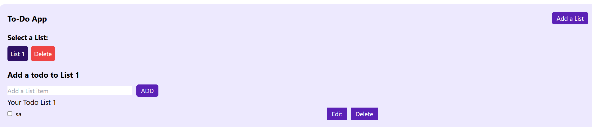

# React Todo App.

A complete todo application with all features.

<!-- **live demo: [https://wc-react-todo-app.netlify.app/](https://wc-react-todo-app.netlify.app/)** -->

<!-- **Watch On Youtube: [https://youtu.be/W0Uf_xu350k](https://youtu.be/W0Uf_xu350k)** -->

---

### Made with  [Ashish kumar](https://www.linkedin.com/in/ashishkumar201/)

Like my works and want to support me?

<!-- <a href="https://www.buymeacoffee.com/shaifarfan08" target="_blank"></a> -->

---

## Project Description

In the project, we will be creating a Complete Todo Application with all features. We will do all the CRUD operations. We will use `React.js` and to manage our states, we will use `Redux`. Also we will learn to make simple animations using `Framer Motion`. This will be a complete `beginner` friendly app. Hope you enjoy it.

## What we are going to learn/use

- [React](https://reactjs.org/)
- [React icons](https://react-icons.netlify.com/)
- More...

## Requirements

- Basic ReactJs knowledge
- Basic HTML, CSS knowledge
- Basic Tailwind Knowledge


## Getting Started
```shell
npm install
```

and after that start the dev server.

```shell
npm start
```

## Tools Used

1. Code Editor: [VS Code](https://code.visualstudio.com/)

## Other projects

📚 [All Web  Projects](https://github.com/Ashishkumar201?tab=repositories)

---

## FAQ
 

### Q: What are the prerequisites?

basics of html, css, javascript and some basic knowledge of react is enough to start this project. Rest you will learn in the tutorial.

### Q: Who the project is for?

The project is for the people who wanna get more skilled in `ReactJs`.

---


Happy Coding! 🚀